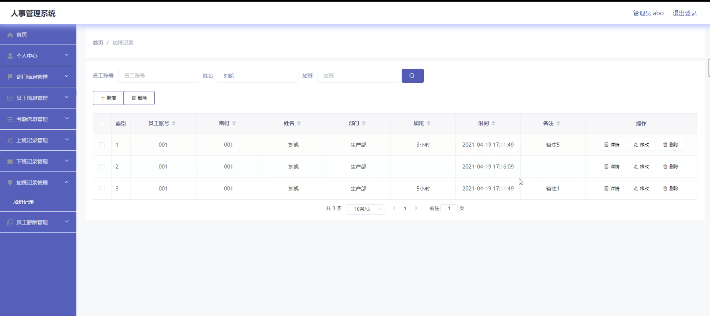

# 基于SpringBoot+Vue的人事系统

#### 介绍

本人事系统基于 SpringBoot 和 Vue 框架开发，旨在为企业提供高效、便捷、准确的人事管理解决方案。通过现代化的技术手段，实现了人事数据的集中管理、流程的自动化处理以及信息的实时共享，从而提高企业的人事管理效率和决策科学性。

#### 技术栈

后端技术栈：Springboot+Mysql+Maven

前端技术栈：Vue+Html+Css+Javascript+ElementUI

开发工具：Idea+Vscode+Navicate

#### 系统功能介绍

（一）管理员角色  
个人中心  
管理员可以查看和修改个人信息，包括登录密码、联系方式等。  
接收系统重要通知和提醒。  
部门信息管理  
新增、编辑和删除部门信息，包括部门名称、职能描述、负责人等。  
调整部门架构，进行部门的合并、拆分或划转。  
员工信息管理  
录入新员工的详细信息，如基本资料、教育背景、工作经历等。  
对现有员工信息进行修改、查询和删除操作。  
批量导入和导出员工信息，方便数据迁移和备份。  
考勤信息管理  
设定考勤规则，如上班时间、下班时间、迟到早退的判定标准等。  
查看员工的考勤记录，包括出勤、请假、旷工等情况。  
对考勤异常情况进行处理和审批。  
上班记录管理   
实时监控员工的上班打卡时间和方式。  
统计上班迟到、未打卡等异常情况。  
下班记录管理  
查看员工的下班打卡时间。  
分析下班早退情况，生成相关报告。  
加班记录管理  
审批员工的加班申请，包括加班时间、加班原因等。  
统计员工的加班时长和加班费用。  
员工薪酬管理  
设定薪酬结构和计算规则，如基本工资、绩效工资、奖金、福利等。  
根据员工的考勤、绩效等数据计算员工薪酬。  
生成薪酬报表，进行薪酬发放和记录。  
（二）用户角色  
个人中心  
员工可以查看和修改个人基本信息。  
查看自己的工作履历和培训记录。  
考勤信息管理  
查看个人的考勤记录和考勤统计。  
申请请假、调休等。  
上班记录管理  
进行上班打卡操作。  
查看上班打卡记录和相关提醒。  
下班记录管理  
进行下班打卡操作。  
查看下班打卡时间和是否正常。  
加班记录管理  
提交加班申请，说明加班原因和预计时长。  
查看加班申请的审批进度。  
员工薪酬管理  
查看个人的薪酬明细和发放记录。  

#### 系统作用

提高人事管理效率  
自动化的考勤、上班、下班和加班记录管理，减少了人工统计的工作量和错误率。  
集中化的员工信息和部门信息管理，方便快速查询和更新，提高了数据的准确性和及时性。  
优化薪酬管理  
科学合理的薪酬计算规则和自动化计算流程，确保薪酬发放的公平性和准确性。  
详细的薪酬报表为企业成本核算和财务分析提供了有力支持。  
提升员工满意度  
员工可以方便地查看个人的考勤、薪酬等信息，增加了透明度和公正性。  
便捷的请假和加班申请流程，提高了员工的工作体验。  
支持决策制定  
丰富的人事数据统计和分析功能，为企业的人力资源规划、招聘策略和绩效管理提供了数据依据。  

#### 系统功能截图

代码结构

数据库表

登录

部门信息

员工信息

考勤信息管理

上班记录管理

下班记录管理

加班记录管理

员工薪酬管理

员工端个人信息

员工薪酬支付

#### 总结

本基于 SpringBoot + Vue 的人事系统，通过清晰的角色划分和丰富的功能模块，实现了企业人事管理的数字化和智能化。不仅提高了管理效率和精度，还为企业的发展提供了有力的人力资源支持，有助于企业在激烈的市场竞争中保持优势。

#### 使用说明

创建数据库，执行数据库脚本 修改jdbc数据库连接参数 下载安装maven依赖jar 启动idea中的springboot项目

后台地址：http://localhost:8080/springboot9v464/admin/dist/index.html

管理员  abo 密码 abo